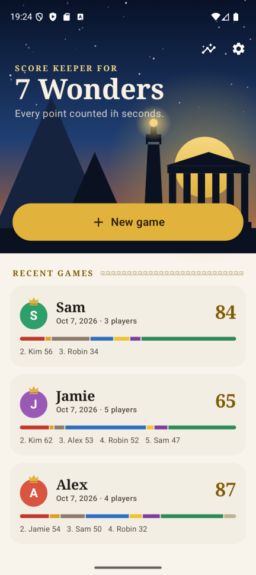
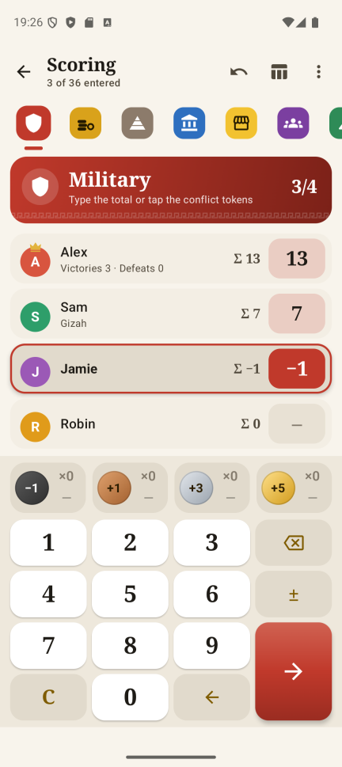
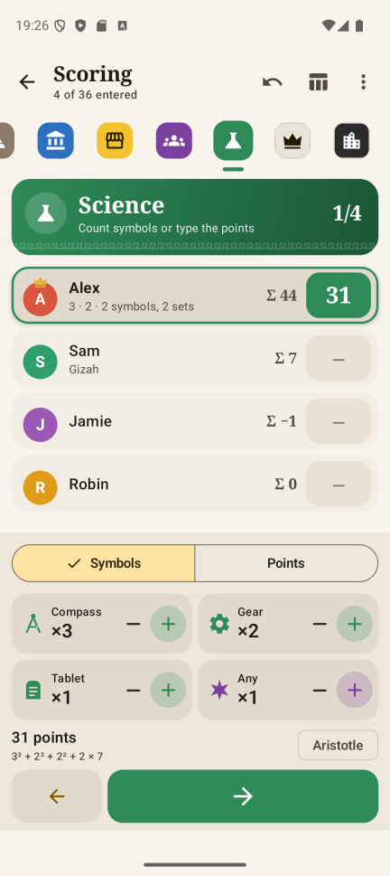
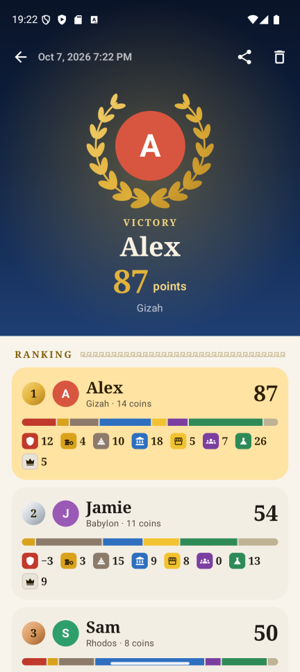
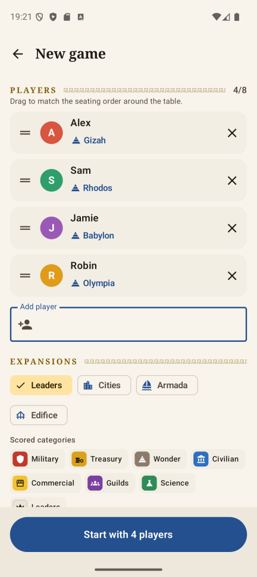
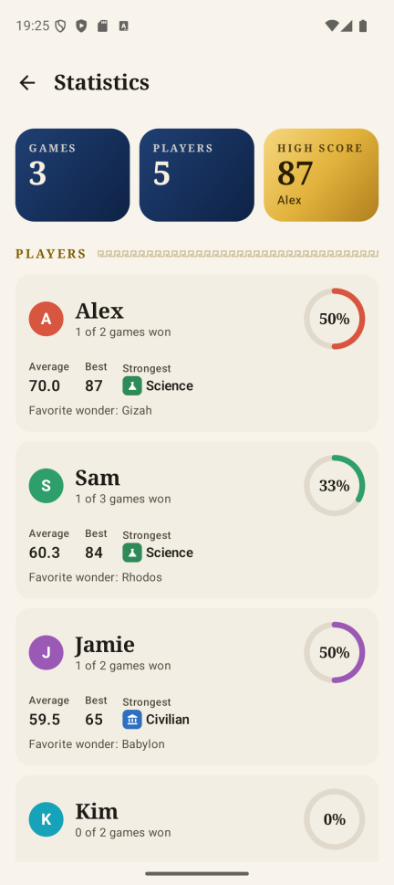
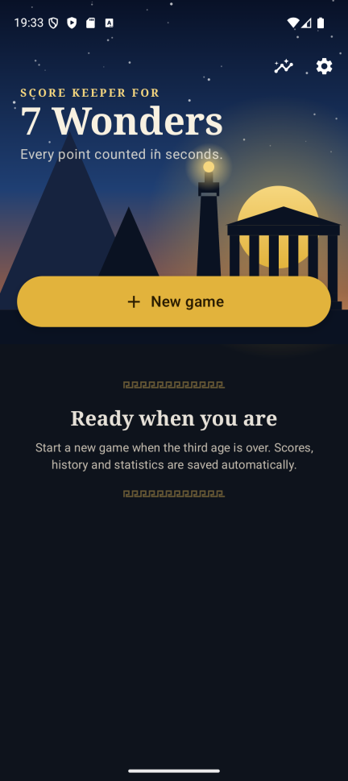

# 7 Wonders Calculator

A fast, offline score calculator for the board game *7 Wonders*. It replaces the paper score pad so that scoring at the end of a game takes about a minute.

<p>
  
  
  
  
</p>

## Features

**Built for speed at the table**
- Score **category by category**, just like the paper score pad: everyone calls out their military points, then treasury, and so on. Or score one player's whole sheet at a time.
- A **built-in number pad** with `±`, previous/next and auto-advance. No system keyboard, roughly one tap per value.
- **Counting aids right next to the pad**, no extra screens:
  - **Military / naval:** tap the conflict tokens (−1, +1, +3, +5), or just type the total.
  - **Treasury:** type your coins, the app divides by 3 and keeps the coins for the tie-breaker. With *Cities*, debt tokens are counted inline.
  - **Science:** count compasses, gears and tablets. **Wildcards** (any-symbol effects) are assigned for the best score, and Aristotle's set bonus is supported.
- Live totals, a crown on the current leader, undo, and a score sheet overview.

**Around the game**
- Expansions: Leaders, Cities, Armada and Edifice add their scoring categories.
- Saved players, "last group" with one tap, drag and drop seating order, optional wonder per player.
- Results with ranking, the official tie-breaker (most coins), a score breakdown per player, share as text, edit and rematch.
- History and statistics: win rate, average and best score, strongest category, favorite wonder, wonder stats.
- Dark mode, landscape layout, English and German with an in-app language switch.
- Everything is stored on the device and saved after every key press: no account, no internet, no ads, no tracking.

<p>
  
  
  
</p>

## Building

Requirements: JDK 17 or newer and the Android SDK with platform 37. Android Studio brings both.

```bash
./gradlew assembleDebug        # build a debug APK
./gradlew installDebug         # install on a connected device or emulator
./gradlew testDebugUnitTest    # run the scoring rule tests
```

The app runs on Android 8.0 (API 26) and newer.

## Tech

- Kotlin, Jetpack Compose with Material 3, single activity with type-safe Navigation Compose
- `ViewModel` + `StateFlow`, Room (game sheets stored as JSON via kotlinx.serialization), DataStore
- AppCompat per-app languages, [Reorderable](https://github.com/Calvin-LL/Reorderable) for drag and drop
- No dependency injection framework: a small manual `AppContainer`

The scoring rules live in [`domain/`](app/src/main/java/de/morhenn/seven_wonders_calculator/domain) as plain Kotlin (science with wildcards, treasury, conflict tokens, ranking with tie-breaker, statistics) and are covered by unit tests.

All icons and illustrations (pyramid, coins, crown, science symbols, skyline, laurel wreath) are original vector drawings made for this app.

## Disclaimer

This is an unofficial fan project. *7 Wonders* and its expansions are trademarks of Repos Production / Asmodee. This app is not affiliated with, endorsed or sponsored by them, and it contains no official artwork, card images or rulebook texts. The game's name is only used to describe what the app is for.
